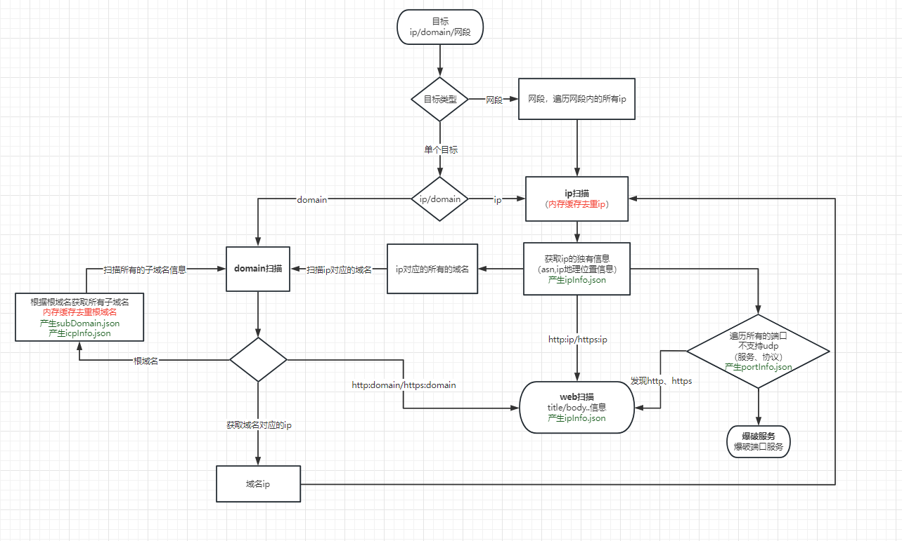

# 扫描器任务流转



# 三方扫描器使用
- 集成方式
```go

go cmd  调用二进制文件
数据存储
1 三方扫描器自带存储json 功能
传参存储
fileName := utils.GetLogPath() + "/subDomain.json"
cmd := exec.Command(global.ServerSetting.ScanPath+"/SubDomain", "-d", domain, "-o", fileName, "-oJ")

2 三方扫描器不带 json存储
通过out获取结果 框架存储

```
## masscan
git clone https://ghproxy.com/https://github.com/robertdavidgraham/masscan.git 
make

##  nmap
```go
yum -y install nmap


nmap -p 8888  124.127.209.46
nmap -p 9090  127.0.0.1
· 扫描漏洞
nmap --script=vuln 127.0.0.1 -oX 127.xml
· whois
nmap -script external zorelworld.com

```


```go
Starting Nmap 7.01 ( https://nmap.org ) at 2023-01-10 00:53 PST
Nmap scan report for 46.209.127.124.broad.bj.bj.static.163data.com.cn (124.127.209.46)
Host is up (0.0072s latency).
PORT     STATE SERVICE
8888/tcp open  sun-answerbook

Nmap done: 1 IP address (1 host up) scanned in 6.59 seconds
```
### nmap 命令
```go
端口状态：

open：开放的

closed：关闭的

filtered：被过滤的

unfiltered：未被过滤的

open|filtered：开放或被过滤的

closed|filterd：关闭或被过滤的
 

用法：nmap [扫描类型] [选项] [目标]

nmap -p- ip：全端口扫描

nmap -A/O ip：检查操作系统版本

nmap -Pn ip：启用无ping检测

nmap -T4 ip：加快执行速度

nmap -iR ip：随机选择目标，可以指定扫描多少台主机，如：-iR 500，扫描500台主机

--exclude ip：排除主机/网络

--excludefile 文本：从文本中排除

nmap -sL ip：列出改网段所有ip地址

nmap -sP ip：ping检查，列出所有ip地址状态，存活/不存活

nmap -P0 ip：不进行主机发现，直接进行扫描

nmap -PS/PA/PU 端口 ip：对指定的端口进行TCP、SYN/ACK、UDP发现

nmap -PE/PP/PM ip：显示icmp、扫描时间、及网络掩码请求等

nmap -n ip：不做dns解析

nmap -R ip：做dns解析

nmap -sI ip：空闲扫描

nmap -sO ip：ip协议扫描

nmap -b ip：ftp反弹扫描

nmap -p 端口 ip：指定端口进行扫描，如：-p 1-65535 、-p 22、-p U:53等

nmap -F ip：快速扫描，仅扫描nmap-services文件中的端口

nmap -r ip：连续扫描端口

nmap -sV ip：探测开放端口，确定服务或版本

nmap -D ip：设置诱饵隐藏扫描

nmap -S ip：欺骗源地址扫描

nmap -6 ip：启用ipv6扫描

nmap -sS ip：进行隐藏SYN扫描

nmap --script=vuln ip：漏洞扫描

nmap --script=brute ip：漏洞扫描。并进行暴力破解，如：数据库、smb、snmp等

nmap --script=ftp-brute.nse ip：对ftp协议密码爆破

nmap --script=external 域名：利用第三方资源进行漏洞扫描，如whios解析

nmap --script=auth ip：主机弱口令扫描

nmap --script=realvnc-auth-bypass ip：常见服务扫描，如：vnc、mysql、telnet、rsync等

nmap --script=broadcast ip：广播收集信息；

nmap --script=default：默认脚本，等同于-sC

nmap --script=discovery：发现主机与所开服务脚本

nmap --script=dos：拒绝服务攻击脚本

nmap --script=exploit：漏洞利用脚本

nmap --script=fuzzer：模糊测试脚本

nmap --script=intrusive：入侵脚本

nmap --script=malware：恶意软件检查脚本

nmap --script=safe：安全脚本

nmap --script=version：高级系统脚本

nmap -sV --script ssl-enum-ciphers 端口 ip/域名：查看ssl下所有弱加密协议

nmap -p 80 --script http-iis-short-name-brute ip：验证iis短文件名泄露 nmap -sV -p 11211 -script memcached-info ip：验证Memcached未授权访问漏洞 nmap -sV -（-）script http-vuln-cve2015-1635 ip：验证http.sys远程代码执行漏洞 nmap -sV --script=ssl-heartbleed ip：验证心脏出血漏洞 nmap -p 27017 --script mongodb-info ip：验证Mongodb未授权访问漏洞 nmap -p 6379 --script redis-info ip：验证Redis未授权访问漏洞 nmap --script=http-vuln-cve2015-1427 --script-args command=‘ls’ ip：验证Elasticsearch未授权访问漏洞 nmap -p 873 --script rsync-brute --script-args ‘rsync-brute.module=www’ ：验证Rsync未授权访问漏洞

nmap -sV --script “（http*）” and not （http-slowlors and http-brute）ip/域名 ：排除暴力破解和dos攻击

nmap --script-updatedb：更新nmap脚本库

nmap --script http-title 域名：探测web服务的title信息

nmap --script http-headers 域名：探测http服务http头

nmap -p 端口 --script=ssh-brute --script-args userdb=用户名字典,passdb=密码字典 ip：暴力破解ssh

nmap --script nmap-vulners -sV ip：使用nmap-vulners脚本，进行目标探测

nmap --script vulscan -sV ip：使用vulscan脚本，进行目标探测

--script-args vulscanoutput='{link}\n{title}\n\n' --script-args vulscanoutput='ID: {id} - Title: {title} ({matches})\n' --script-args vulscanoutput='{id} | {product} | {version}\n'

{id}-漏洞的id
{title}-漏洞的标题
{matches}-匹配数
{product}-匹配的产品字符串
{version}-匹配的版本字符串
{link}-指向漏洞数据库条目的链接
\n-新线
\t-标签
————————————————
版权声明：本文为CSDN博主「KUIT_命运」的原创文章，遵循CC 4.0 BY-SA版权协议，转载请附上原文出处链接及本声明。
原文链接：https://blog.csdn.net/weixin_41955441/article/details/127249261
```

### nmap常用方法
```go
一、nmap常用方法
1.扫描单个目标地址
nmap 192.168.0.100
2.扫描多个目标地址
nmap 192.168.0.100 192.168.0.105
3.扫描一个范围内的目标地址
nmap 192.168.0.100-110
4.扫描目标地址所在的某个网段
nmap 192.168.0.0/24
5.扫描主机列表targets.txt中的所有目标地址
nmap -iL d:\targets.txt
6.扫描除某一个目标地址之外的所有目标地址
nmap 192.168.0.0/24 -exclude 192.168.109.105
7.扫描除某一文件中的目标地址之外的目标地址
nmap 192.168.0.0/24 -excludefile d:\targets.txt
8.扫描某一目标地址的21、22、23、80端口
nmap 192.168.0.100 -p 21,22,23,80
9.对目标地址进行路由跟踪
nmap --traceroute 192.168.0.105
10.扫描目标地址所在C段的在线情况
nmap -sP 192.168.0.0/24
11.目标地址的操作系统指纹识别
nmap -O 192.168.0.105
12.目标地址提供的服务版本检测
nmap -sV 192.168.0.105
13.探测防火墙状态
在实战中，可以利用FIN扫描的方式探测防火墙的状态。FIN扫描用于识别端口是否关闭，收到RST回复说明该端口关闭，否则就是open或filtered状态。

nmap -sF -T4 192.168.0.105
二、nmap脚本实例
1、鉴权扫描
使用--script=auth可以对目标主机或目标主机所在的网段进行应用弱口令检测

nmap --script=auth 192.168.0.105
2.暴力破解攻击
nmap具有暴力破解的功能，可对数据库、SMB、SNMP等进行简单密码的暴力猜解

nmap --script=brute 192.168.0.105
3.扫描常见的漏洞
nmap具有漏洞扫描的功能，可以检查目标主机或网段是否存在常见的漏洞

nmap --script=vuln 192.168.0.105
4.应用服务扫描
nmap具备很多常见应用服务的扫描脚本，例如VNC服务、MySQL服务、Telnet服务、Rsync服务等，以VNC服务为例

nmap --script=realvnc-auth-bypass 192.168.0.105
5.探测局域网内更多服务开启的情况
nmap -n -p 445 --script=broadcast 192.168.0.105
6.whois解析
利用第三方的数据库或资源查询目标地址的信息，例如进行whois解析

nmap -script external baidu.com
————————————————
版权声明：本文为CSDN博主「冰 河」的原创文章，遵循CC 4.0 BY-SA版权协议，转载请附上原文出处链接及本声明。
原文链接：https://blog.csdn.net/l1028386804/article/details/85850555
```
## Starmap
命令执行
```go
./SubDomain -d github.com -b -rW -oJ -o subDomain.json
./SubDomain -d zorelworld.com -b -rW -oJ -o subDomain.json

```
环境问题
```go
error while loading shared libraries: libpcap.so.0.8: cannot open shared object file: No such file or directory
yum install libpcap-devel
```


## xray

https://github.com/chaitin/xray

xray webscan --basic-crawler http://www.zorelworld.com/ --html-output zw.html

## nuclei
https://github.com/projectdiscovery/nuclei/blob/main/README_CN.md

# 相关包

##  定时任务
github.com/robfig/cron


##  ip2region
```go
go 生成器
https://gitee.com/lionsoul/ip2region.git

配置文件中的离线db  是这个开源项目生成的
https://github.com/lionsoul2014/ip2region

https://github.com/lionsoul2014/ip2region/tree/master/binding/golang

可以使用里面的ip  来进行全球资产的扫描

ip.merge.txt  来自此项目

```

## chromedp  截图
go get -u github.com/chromedp/chromedp
```go
1 go mod 先关掉  go env -w GO111MODULE=off
2 执行 go get -u github.com/chromedp/chromedp
3 打开  go env -w GO111MODULE=on
```
```go
##下载源加入到系统的源列表
sudo wget http://www.linuxidc.com/files/repo/google-chrome.list -P /etc/apt/sources.list.d/

手动下载到   /etc/apt/sources.list.d/
##导入谷歌软件公钥
wget -q -O - https://dl.google.com/linux/linux_signing_key.pub  | sudo apt-key add -

apt-key add linux_signing_key.pub

##更新列表
sudo apt-get update

##安装chrome
sudo apt-get install google-chrome-stable

下载
https://dl.google.com/linux/direct/google-chrome-stable_current_amd64.deb

dpkg -i google-chrome-stable_current_amd64.deb

```
##gonmap 
```go
https://svn.nmap.org/nmap/nmap-service-probes
指纹地址
```
# 修改过的包

## Starmap
```go
修改子域名查询  保存root 根目录
```
## gonmap

```go
修改可以进行udp的端口检测
```